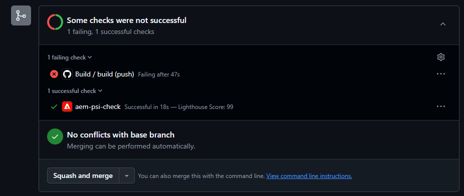
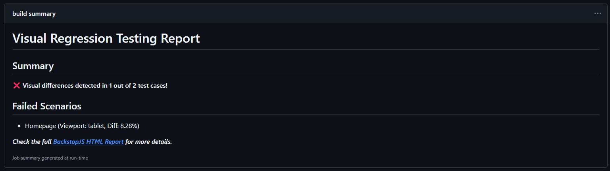
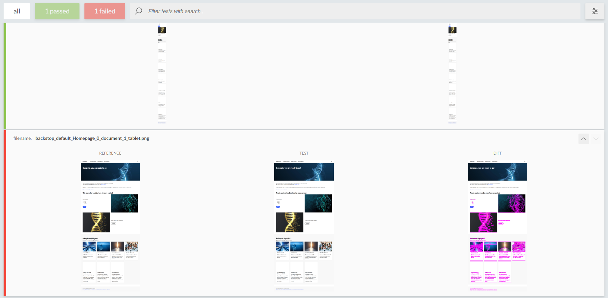

# AEM EDS BackstopJS Workflow
This repository serves as an example of how BackstopJS can be integrated to easily add visual testing to a site. Using BackstopJS within EDS can significantly help ensure that no existing functionality is broken after changes are made.

## Preview
Each time you commit to the branch, a build will be executed. If there are any differences from the `main` branch, the workflow will fail. See the example below:


If you open the failed workflow, you will see a failure summary. See the example below:


To investigate the changes causing the failure, you can download the detailed HTML report via the link in the summary. In the downloaded archive, the report will be located at `{your downloaded report}/html_report/index.html`. This report contains the complete BackstopJS report:


## Per Project Adjustments
The `backstop.js` file contains all BackstopJS configurations. Adjust the URL in this file and add as many pages to test as needed. All configurations are standard BackstopJS.

## Environments
- Preview: https://main--aem-eds-backstop-workflow--proxinadu.aem.page/
- Live: https://main--aem-eds-backstop-workflow--proxinadu.aem.live/

## Installation

```sh
npm i
```

## Linting

```sh
npm run lint
```

## Local development

1. Create a new repository based on the `aem-boilerplate` template and add a mountpoint in the `fstab.yaml`
1. Add the [AEM Code Sync GitHub App](https://github.com/apps/aem-code-sync) to the repository
1. Install the [AEM CLI](https://github.com/adobe/helix-cli): `npm install -g @adobe/aem-cli`
1. Start AEM Proxy: `aem up` (opens your browser at `http://localhost:3000`)
1. Open the `{repo}` directory in your favorite IDE and start coding :)